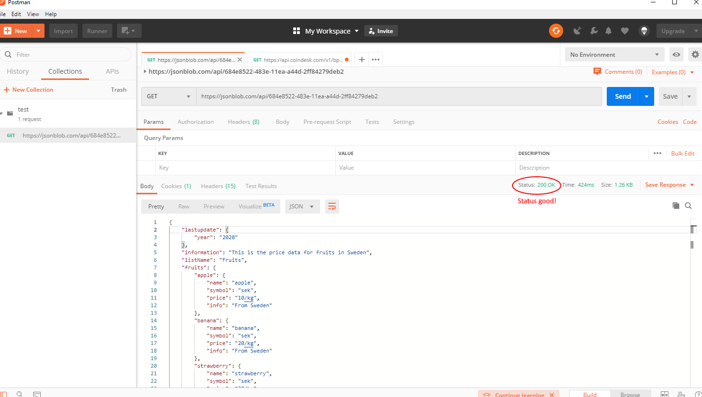

# Android_Studio_MyConverterAPI

API JSON contains Fruits with multiple arttributes, what year API was updated, information etc... 
The APP has an Edittext input where you write your fruit and if it is a fruit we check information about that fruit and give it to you. If the request doesnt work it will check and let you know in text. 

